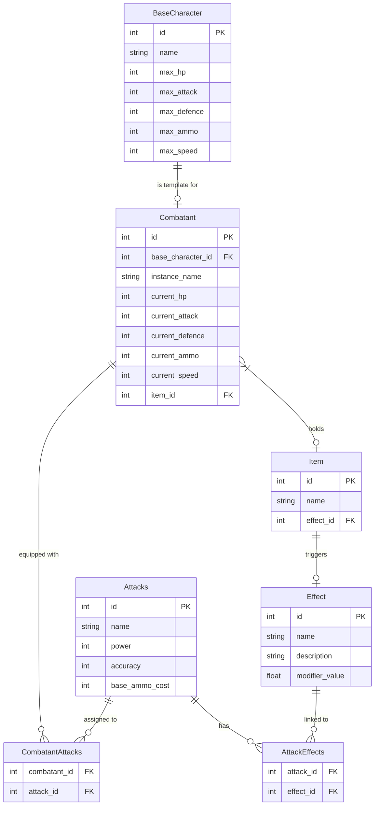

```mermaid
erDiagram
    BaseCharacter ||--o| Combatant : "is template for"
    Combatant ||--o{ CombatantAttacks : "equipped with"
    Attacks ||--o{ CombatantAttacks : "assigned to"
    Combatant }|--o| Item : "holds"
    Attacks ||--o{ AttackEffects : "has"
    Effect ||--o{ AttackEffects : "linked to"
    Item ||--o| Effect : "triggers"

    BaseCharacter {
        int id PK
        string name
        int max_hp
        int max_attack
        int max_defence
        int max_ammo
        int max_speed
    }

    Combatant {
        int id PK
        int base_character_id FK
        string instance_name
        int current_hp
        int current_attack
        int current_defence
        int current_ammo
        int current_speed
        int item_id FK
    }

    Attacks {
        int id PK
        string name
        int power
        int accuracy
        int base_ammo_cost
    }

    CombatantAttacks {
        int combatant_id FK
        int attack_id FK
    }

    Item {
        int id PK
        string name
        int effect_id FK
    }

    Effect {
        int id PK
        string name
        string description
        float modifier_value
    }

    AttackEffects {
        int attack_id FK
        int effect_id FK
    }
```
