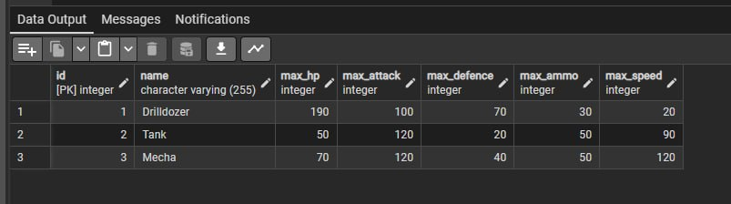
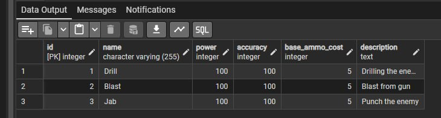
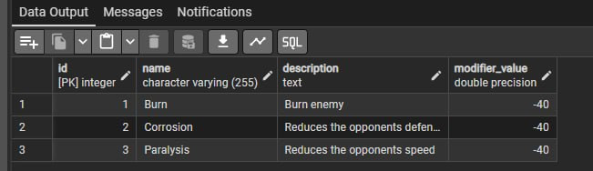
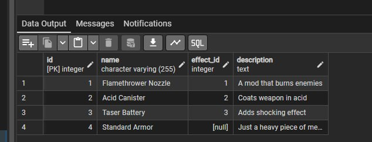

# Лабораторна робота №2 Виконали: Стіренко Тимофій та Клименко Андрій
В цій лабораторній роботі ми реалізували... 
## Вимоги
**Мета:** Перетворити концептуальну ER-модель на фізичну реляційну схему бази даних. Написати SQL DDL-інструкції для створення таблиць, визначити типи даних, налаштувати зв'язки (зовнішні ключі) та обмеження цілісності даних (PRIMARY KEY, CHECK, NOT NULL), а також заповнити базу тестовими даними.
## Опис схеми та технічні рішення
Кожна сутність з нашої ER-діаграми була перетворена на відповідну таблицю у PostgreSQL.

1. **Базові таблиці-довідники:**
   - `BaseCharacter`: Зберігає базові характеристики класів. Усі числові параметри (HP, атака, швидкість) мають обмеження `CHECK (> 0)`.
   - `Attacks` та `Effect`: Зберігають типи атак та можливі ігрові ефекти відповідно.
   - `Item`: Зберігає предмети інвентарю. Має зовнішній ключ `effect_id`, який може бути `NULL` (оскільки не кожен предмет має спеціальний ефект).

2. **Таблиці екземплярів (динамічні дані):**
   - `Combatant`: Представляє конкретного бійця на полі бою. Пов'язаний зовнішніми ключами (`FOREIGN KEY`) з таблицями `BaseCharacter` (шаблон) та `Item` (активний предмет). Поточні показники здоров'я та амуніції обмежені `CHECK (>= 0)`, щоб не допускати від'ємних значень під час бою.

3. **Реалізація зв'язків "Багато-до-багатьох" (N:M):**
   - Створено таблиці-сполучення `CombatantAttacks` (для зв'язку бійців та їхніх атак) та `AttackEffects` (для зв'язку атак та ефектів, які вони накладають).
## SQL код
```sql
-- SQL table for base characters, with options for character's stats
CREATE TABLE BaseCharacter (
  id SERIAL PRIMARY KEY,
    name VARCHAR(255) NOT NULL,
    max_hp INT CHECK (max_hp > 0),
    max_attack INT CHECK (max_attack > 0),
    max_defence INT CHECK (max_defence > 0),
    max_ammo INT CHECK (max_ammo > 0),
    max_speed INT CHECK (max_speed > 0)
);

-- SQL table for attacks, with options for attack's stats
CREATE TABLE Attacks (
  id SERIAL PRIMARY KEY,
  name VARCHAR(255) NOT NULL,
  power INT CHECK (power > 0),
  accuracy INT CHECK (accuracy BETWEEN 0 AND 100),
  base_ammo_cost INT CHECK (base_ammo_cost >= 0)
);

-- SQL table for effects, with options for effect's stats
CREATE TABLE Effect (
  id SERIAL PRIMARY KEY,
  name VARCHAR(255) NOT NULL, 
  description VARCHAR(255) NOT NULL, 
  modifier_value FLOAT -- positive for buffs, negative for debuffs
);

-- SQL table for items, with options for item's stats and reference to effects
CREATE TABLE Item (
  id SERIAL PRIMARY KEY,
  name VARCHAR(255) NOT NULL, 
  effect_id INT REFERENCES Effect(id)
);  

-- SQL table for combatants, with reference to base character and item, and options for current stats
CREATE TABLE Combatant (
    id SERIAL PRIMARY KEY,
    base_character_id INT REFERENCES BaseCharacter(id),
    instance_name VARCHAR(255) NOT NULL,
    current_hp INT CHECK (current_hp >= 0),
    current_attack INT CHECK (current_attack >= 0),
    current_defence INT CHECK (current_defence >= 0),
    current_ammo INT CHECK (current_ammo >= 0),
    current_speed INT CHECK (current_speed >= 0),
    item_id INT REFERENCES Item(id) -- can be NULL for no item
);

-- SQL table for combatant attacks, with reference to attacks
CREATE TABLE CombatantAttacks (
  id SERIAL PRIMARY KEY,
  attack_id INT REFERENCES Attacks(id)
);  

-- SQL table for attack effects, with reference to attacks and effects (many-to-many relationship)
CREATE TABLE AttackEffects (
  attack_id INT REFERENCES Attacks(id),
  effect_id INT REFERENCES Effect(id)
);

-- Insertion of characters into BaseCharacter table, with their respective stats
INSERT INTO BaseCharacter (name, max_hp, max_attack, max_defence, max_ammo, max_speed)
VALUES  ('Drilldozer', 190, 100, 70, 30, 20),
    ('Tank', 50, 120, 20, 50, 90),
    ('Mecha', 70, 120, 40, 50, 120);

-- Adding description columns to Attacks and Item tables, and changing Effect description to TEXT for longer descriptions
ALTER TABLE Attacks
ADD COLUMN description TEXT;

ALTER TABLE Effect 
ALTER COLUMN description TYPE TEXT;

ALTER TABLE Item
ADD COLUMN description TEXT;

-- Insertion of attacks into Attacks table, with their respective stats and descriptions
INSERT INTO Attacks (name, power, accuracy, base_ammo_cost, description)
VALUES  ('Drill', 100, 100, 5, 'Drilling the enemy'),
    ('Blast', 100, 100, 5, 'Blast from gun'),
    ('Jab', 100, 100, 5, 'Punch the enemy');

-- Insertion of effects into Effect table, with their respective descriptions and modifier values
INSERT INTO Effect (name, description, modifier_value)
VALUES  ('Burn', 'Burn enemy', -40),
    ('Corrosion','Reduces the opponents defense', -40),
    ('Paralysis','Reduces the opponents speed', -40);

-- Insertion of items into Item table, with their respective descriptions and reference to effects
INSERT INTO Item (name, description, effect_id)
VALUES  ('Flamethrower Nozzle', 'A mod that burns enemies', 1),
       ('Acid Canister', 'Coats weapon in acid', 2),   
      ('Taser Battery', 'Adds shocking effect', 3), 
    ('Standard Armor', 'Just a heavy piece of metal', NULL); -- NULL effect_id for effectless item
```
## Скріншоти SQL




## Висновок
У ході виконання лабораторної роботи ми успішно перенесли концептуальну ER-модель у середовище PostgreSQL. Завдяки використанню обмежень `CHECK` та `FOREIGN KEY` було забезпечено цілісність даних на рівні бази (наприклад, неможливість мати від'ємне здоров'я або використовувати неіснуючий предмет). Заповнення бази тестовими даними підтвердило правильність архітектури зв'язків "один-до-багатьох" та "багато-до-багатьох".