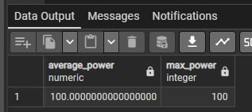
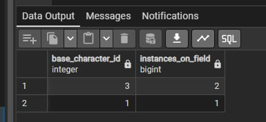
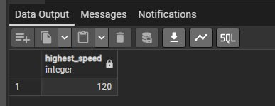
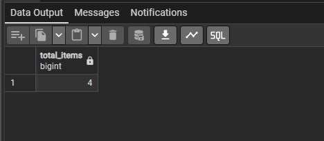
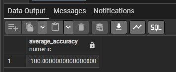
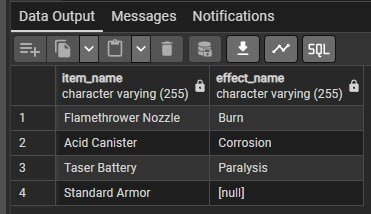

# Лабораторна робота №4 Виконали: Стіренко Тимофій та Клименко Андрій
## Вимоги
**Мета:** Практичне закріплення навичок написання аналітичних (OLAP) SQL-запитів у PostgreSQL. Використання агрегатних функцій, групування даних та об'єднання таблиць (`JOIN`) для підсумовування тенденцій, створення зведеної статистики та аналізу даних реляційної бази даних.
## SQL код
```sql
-- This query calculates the average and maximum power of all available attacks
SELECT 
    AVG(power) AS average_power, 
    MAX(power) AS max_power 
FROM Attacks;

-- This query counts the number of active combatants on the field for each base character class
SELECT 
    base_character_id, 
    COUNT(*) AS instances_on_field 
FROM Combatant
GROUP BY base_character_id;

-- This query finds the highest maximum speed among all base character templates
SELECT MAX(max_speed) AS highest_speed
FROM BaseCharacter;

-- This query counts the total number of items stored in the database
SELECT COUNT(*) AS total_items
FROM Item;

-- This query identifies effect IDs that are linked to 2 or more items using the HAVING clause
SELECT effect_id, COUNT(*) AS related_items_count
FROM Item
GROUP BY effect_id
HAVING COUNT(*) >= 2;

-- This query calculates the average accuracy across all attacks
SELECT AVG(accuracy) AS average_accuracy
FROM attacks;

-- This query calculates the total sum of the base ammo costs for all attacks combined
SELECT SUM(base_ammo_cost) as sum_ammo
FROM attacks;

-- This query retrieves a list of all items and their corresponding effect names (including items with no effects)
SELECT 
    Item.name AS item_name, 
    Effect.name AS effect_name
FROM Item
LEFT JOIN Effect ON Item.effect_id = Effect.id;
```
## Сріншоти











## Висновок
У ході виконання лабораторної роботи ми успішно закріпили навички написання аналітичних (OLAP) запитів у PostgreSQL. Для аналізу ігрової статистики ми використали базові агрегатні функції (AVG, MAX, COUNT, SUM), що дозволило обчислити середні та максимальні показники атак і швидкості. Також ми застосували групування даних за допомогою GROUP BY та фільтрацію згрупованих результатів через HAVING. Для аналізу зв'язаних даних з кількох таблиць було використано LEFT JOIN, що дозволило коректно вивести предмети разом з їхніми ефектами. Усі створені запити відпрацювали без помилок і повернули коректні зведені дані.
