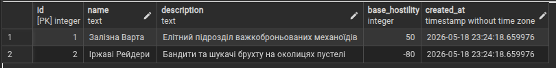
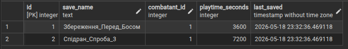
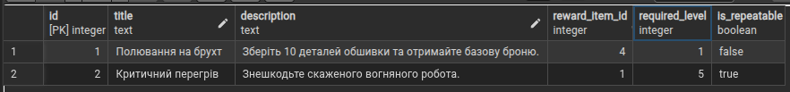

# Лабораторна робота 6: Міграції схем за допомогою Prisma ORM

## Цілі

- Використати Prisma ORM для керування схемами та дослідити, як Prisma може аналізувати та змінювати схему вашої бази даних.
- Застосування міграцій - генерування та застосування змін схеми (таблиць, стовпців, зв'язків) за допомогою `prisma migrate`.
- Моделювання за допомогою файлів схеми Prisma - визначення таблиць та зв'язків у `schema.prisma` та перегляд їхнього відображення в PostgreSQL.
- Виконати базові запити Prisma - вставити та запитати дані за допомогою клієнта Prisma (через *Prisma Studio* або простий скрипт) для перевірки змін.

## 1. V2_adding_fractions.sql
Ця міграція вводить механіку ігрових фракцій та базового ставлення (репутації) до гравця.
```sql
CREATE TABLE Factions (
    id SERIAL PRIMARY KEY,
    name TEXT NOT NULL UNIQUE,
    description TEXT,
    base_hostility INT DEFAULT 0 CHECK (base_hostility BETWEEN -100 AND 100),
    created_at TIMESTAMP DEFAULT CURRENT_TIMESTAMP
);

INSERT INTO Factions (name, description, base_hostility)
VALUES  
    ('Залізна Варта', 'Елітний підрозділ важкоброньованих механоїдів', 50),
    ('Іржаві Рейдери', 'Бандити та шукачі брухту на околицях пустелі', -80);
```


## 2. V3_adding_player_saves.sql
Міграція реалізує можливість фіксації прогресу користувачів.
```sql
CREATE TABLE PlayerSaves (
    id SERIAL PRIMARY KEY,
    save_name TEXT NOT NULL,
    combatant_id INT REFERENCES Combatant(id) ON DELETE CASCADE,
    playtime_seconds INT DEFAULT 0 CHECK (playtime_seconds >= 0),
    last_saved TIMESTAMP DEFAULT CURRENT_TIMESTAMP
);

INSERT INTO PlayerSaves (save_name, combatant_id, playtime_seconds)
VALUES  
    ('Збереження_Перед_Босом', 1, 3600),
    ('Спідран_Спроба_3', 1, 7200);
```


## 3. V4_adding_quests.sql
Ця міграція додає механіку ігрових завдань та винагород за їхнє виконання.
```sql
CREATE TABLE Quests (
    id SERIAL PRIMARY KEY,
    title TEXT NOT NULL,
    description TEXT NOT NULL,
    reward_item_id INT REFERENCES Item(id) ON DELETE SET NULL,
    required_level INT DEFAULT 1,
    is_repeatable BOOLEAN DEFAULT FALSE
);

INSERT INTO Quests (title, description, reward_item_id, required_level, is_repeatable)
VALUES  
    ('Полювання на брухт', 'Зберіть 10 деталей обшивки та отримайте базову броню.', 4, 1, FALSE),
    ('Критичний перегрів', 'Знешкодьте скаженого вогняного робота.', 1, 5, TRUE);
```


## 4. Ініціалізація проєкту та інтроспекція бази даних за допомогою Prisma ORM
У цій лабораторній роботі було використано архітектурний підхід **Database-First** (спочатку створення бази даних, а потім генерація коду). Замість ручного проектування моделей у файлі `schema.prisma`, налаштування та синхронізація проєкту відбувалися автоматично за допомогою CLI-команд Prisma.
```shell
npm init -y
npm install prisma --save-dev
npx prisma init --datasource-provider postgresql

npx prisma db pull
```
## Висновки

Під час виконання лабораторної роботи №6 було опановано інструментарій **Prisma ORM** для керування еволюцією схеми бази даних за допомогою механізму міграцій та підходу *Database-First*.

1. **Досліджено процес еволюції схем:** Створено та застосовано три послідовні SQL-міграції (`V2`, `V3`, `V4`), які дозволили гнучко розширити структуру ігрової бази даних сутностями фракцій, збережень та квестів без втрати або пошкодження існуючої інформації.
2. **Забезпечено цілісність даних на рівні СУБД:** Налаштовано обмеження типів даних (`CHECK` для діапазонів значень та невід'ємних чисел), а також правила каскадного видалення (`ON DELETE CASCADE`) для системи збережень та занулення зв'язків (`ON DELETE SET NULL`) для предметів-винагород у квестах, що гарантує архітектурну стабільність бази даних.
3. **Освоєно інструменти екосистеми Prisma:** Практично перевірено роботу команд `prisma db pull` для автоматичної інтроспекції live-бази даних та `prisma generate` для оновлення типів клієнта й інтеграції їх у вихідний код проєкту. Використання *Prisma Studio* підтвердило повну відповідність структури згенерованих моделей реальним таблицям у PostgreSQL та успішне наповнення бази початковими тестовими даними.